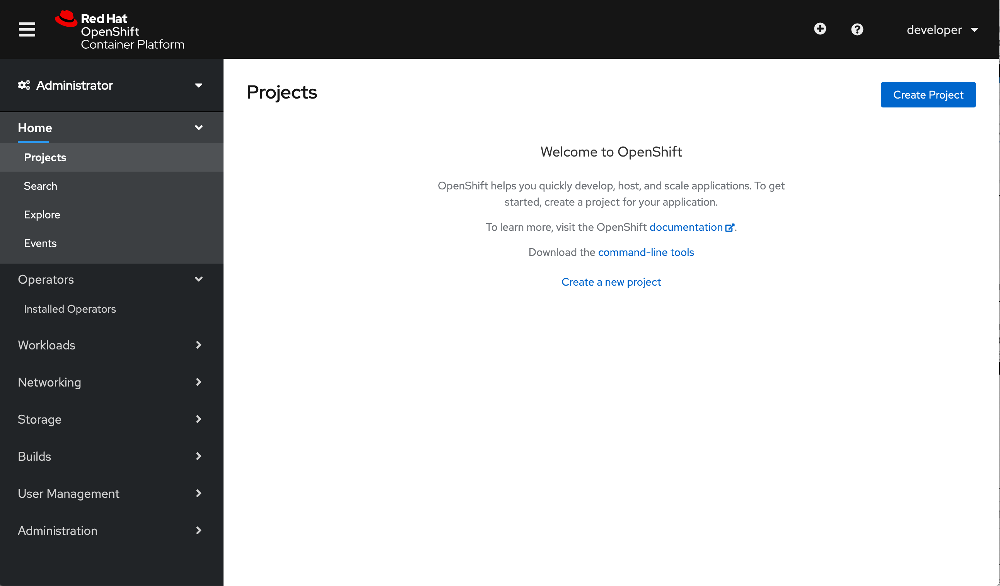
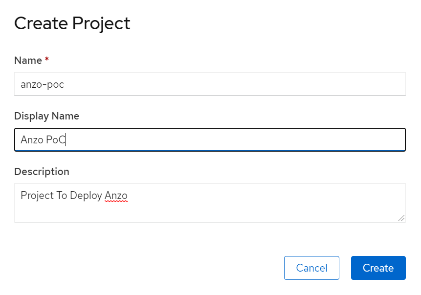
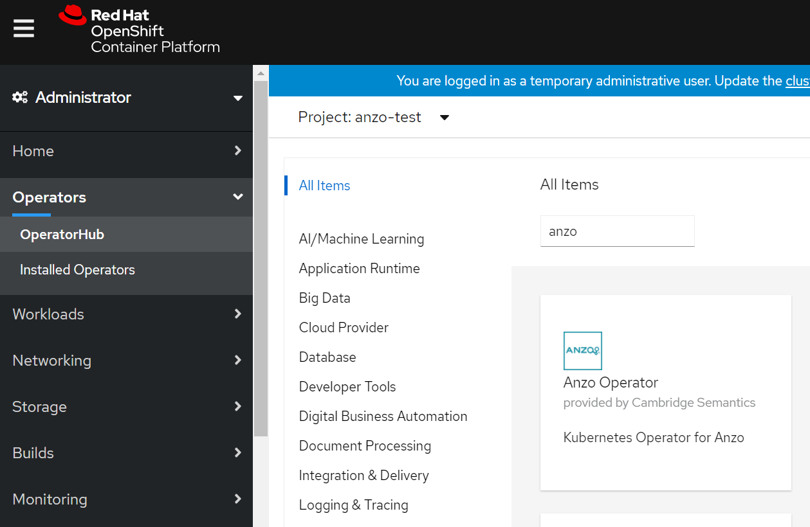
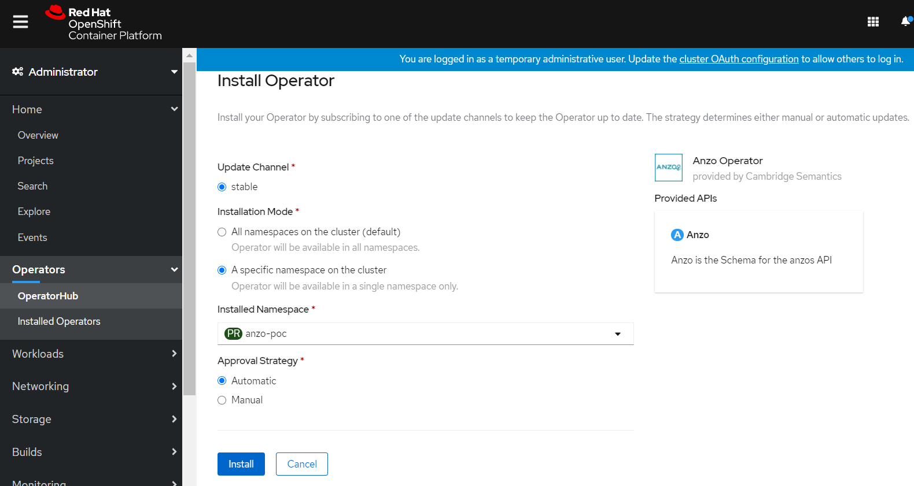
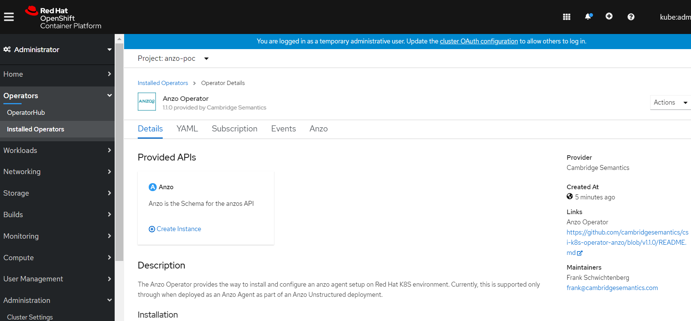
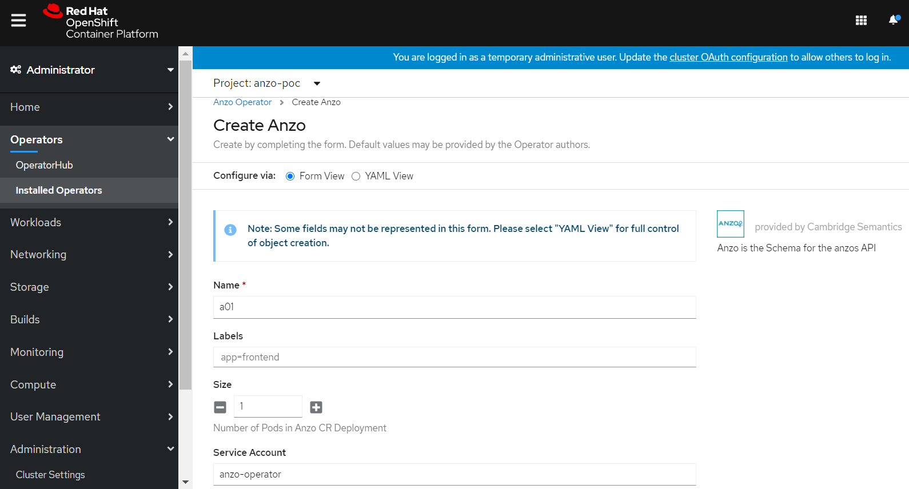
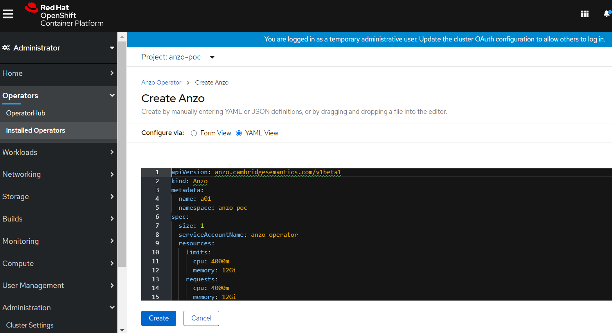

# anzo-operator

## By Cambridge Semantics Inc.

## Prerequisites

* Red Hat Openshift Container Platform on Kubernetes, version >= 4.3
* Kubectl, versions {1.18-1.14}
* Anzo Operator Subscription

## Optional Prerequisites
### Create Project(Namespace) if required



## Steps to deploy Anzo Operator

#### Login to OpenShift Console:

#### Operators --> OperatorHub --> Search Anzo Operator --> Install


#### Select Namespace where you want to deploy the operator and click on Install


#### And check that operator installation is successful

## Steps to deploy Anzo Cluster

#### Operators --> Installed Operators --> Anzo Operator --> Create Instance


#### Use either Form View or YAML View to set required properties, use **Anzo CustomResource(CR) Specification** for definitions



## Anzo CustomResource(CR) Specification

The following table lists the configurable parameters for Anzo and their default values.(CR API Version: v1beta1)

| Parameter | Description | Default |
|-----------|-------------|---------|
| `metadata.name` | Name of CR | a01 |
| `metadata.namespace` | Namespace of CR | |
| `metadata.labels` | Dictionary of (key: val) as labels of CR | |
| `spec.serviceAccountName` | Name of service account for deploying CR | anzo-operator |
| `spec.role` | Role of Anzo, AnzoAgent or AnzoServer | |
| `spec.image.registry` | Docker image registry for Anzo All-in-One image | docker.io |
| `spec.image.name` | Docker image name for Anzo All-in-one image | cambridgesemantics/anzo |
| `spec.image.tag` | Docker image tag for Anzo All-in-one image | latest |
| `spec.image.pullPolicy` | Docker image pull policy for Anzo All-in-one image | IfNotPresent |
| `spec.size` | Size of Anzo pod, only single pod allowed | 1 |
| `spec.resources.requests.cpu` | Resource request for Anzo container, number of CPUs | 2000m |
| `spec.resources.requests.memory` | Resource request for Anzo container, memory size in MB | 7340M |
| `spec.resources.limits.cpu` | Resource limit for Anzo container, number of CPUs | 16000m |
| `spec.resources.limits.memory` | Resource limit for Anzo container, memory size in MB | 50331M |
| `spec.tolerations` | Anzo database pod tolerations | |
| `spec.affinity` | Anzo database pod node affinity | |
| `spec.service` | Database loadbalancer service attributes, of type v1.Service | commented, please uncomment to add value |
| `spec.volumes` | List of persistent volumes for Anzo DB | commented, please uncomment to add value |
| `spec.volumes.[i].name` | Name for persistent volume | |
| `spec.volumes.[i].mountPath` | Path where persistent volume should be mounted inside container | |
| `spec.volumes.[i].pv` | Attributes to configure persistent volume, of type v1.PersistentVolume | |
| `spec.volumes.[i].pvc` | Attributes to configure persistent volume claim, of type v1.PersistentVolumeClaim | |
| `spec.license` | User provided license string | "" |
| `spec.credentials` | Existing credentials for AnzoAgent or AnzoServer | commented, please uncomment to add value |
| `spec.macID` | Anzo Mac ID associated with licese | |
| `spec.jsonActivation` | Set this to true if Anzo should be activated using JSON data file | |
| `spec.bootProperties` | Dictinary having <filename: filecontent> combination to configure boot properties at Anzo installation | |
| `spec.jvmMemory` | Amount of memory that should be given for JVM processing | (Pod Memory - 1204M) |

## References

```https://docs.cambridgesemantics.com/```
