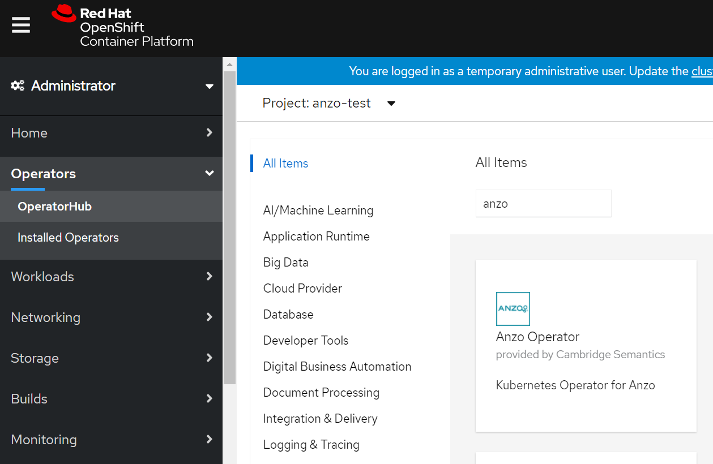
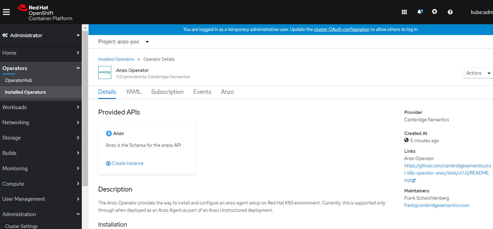
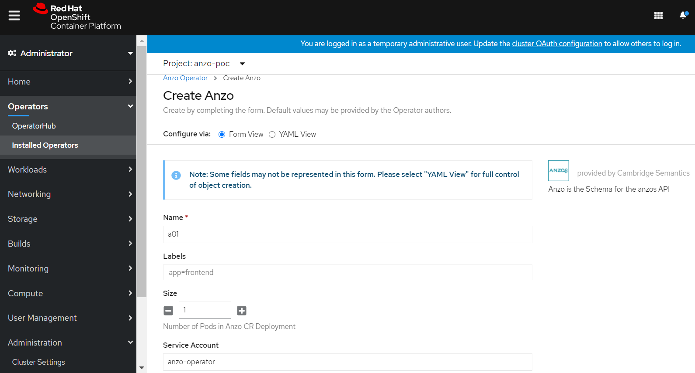
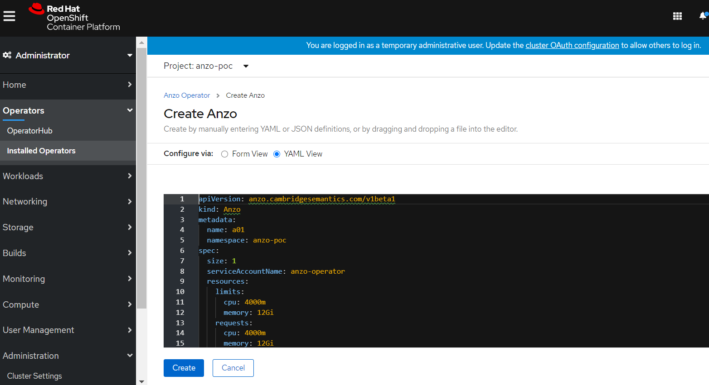

# anzo-operator

## By Cambridge Semantics Inc.

## Prerequisites

* Red Hat Openshift Container Platform on Kubernetes, version >= 4.3
* Kubectl, versions {1.20-1.16}
* Anzo Operator Subscription

## Optional Prerequisites
### Create Project(Namespace) if required


## Steps to deploy Anzo Operator

#### Login to OpenShift Console:

#### Operators --> OperatorHub --> Search Anzo Operator --> Install


#### Select Namespace where you want to deploy the operator and click on Install


#### And check that operator installation is successful

## Steps to deploy Anzo Cluster

#### Operators --> Installed Operators --> Anzo Operator --> Create Instance


#### Use either Form View or YAML View to set required properties, use **Anzo CustomResource(CR) Specification** for definitions



## Anzo CustomResource(CR) Specification

The following table lists the configurable parameters for Anzo and their default values.(CR API Version: v1)

| Parameter | Description | Default |
|-----------|-------------|---------|
| `metadata.name` | Name of CR | a01 |
| `metadata.namespace` | Namespace of CR | |
| `metadata.labels` | Dictionary of (key: val) as labels of CR | |
| `spec.nodeConfig.spec` | Configuration specification for Anzo | |
| `spec.nodeConfig.spec.replicas` | Number of pods for Anzo Agent or Server | 1 |
| `spec.nodeConfig.spec.serviceName` | Name of headless service for Anzo | anzo-<metadata.name> |
| `spec.nodeConfig.spec.template.spec.serviceAccountName` | Service account name for pods | anzo-operator |
| `spec.nodeConfig.spec.template.spec.containers.x.Name` | Name of Anzo container | anzo |
| `spec.service` | Anzo loadbalancer service attributes, of type v1.Service | commented, please uncomment to add value |
| `spec.volumes` | List of persistent volumes for Anzo | commented, please uncomment to add value |
| `spec.volumes.[i].name` | Name for persistent volume | |
| `spec.volumes.[i].mountPath` | Path where persistent volume should be mounted inside container | |
| `spec.volumes.[i].pv` | Attributes to configure persistent volume, of type v1.PersistentVolume | |
| `spec.volumes.[i].pvc` | Attributes to configure persistent volume claim, of type v1.PersistentVolumeClaim | |
| `spec.volumes.[i].deletePVC` | Set this to true if you want to delete PVC after CR deletion | false |
| `spec.role` | Role of Anzo, AnzoAgent or AnzoServer | |
| `spec.license` | User provided license string | "" |
| `spec.credentials` | Existing credentials for AnzoAgent or AnzoServer | commented, please uncomment to add value |
| `spec.macID` | Anzo Mac ID associated with licese | |
| `spec.jsonActivation` | Set this to true if Anzo should be activated using JSON data file | |
| `spec.bootProperties` | Dictinary having <filename: filecontent> combination to configure boot properties at Anzo installation | |
| `spec.jvmMemory` | Amount of memory that should be given for JVM processing | (Pod Memory - 1204M) |
| `spec.skipLbCheck` | Set this to true if you want to disable the check of loadbalancer | false |

## References

```https://docs.cambridgesemantics.com/```
